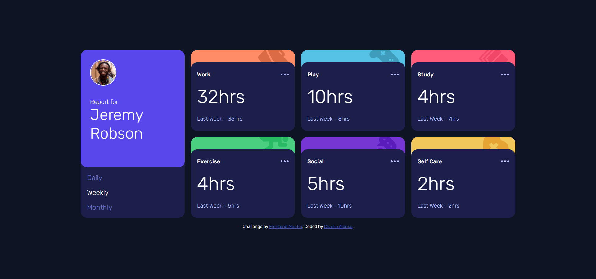

# Frontend Mentor - Time tracking dashboard solution

This is a solution to the [Time tracking dashboard challenge on Frontend Mentor](https://www.frontendmentor.io/challenges/time-tracking-dashboard-UIQ7167Jw). Frontend Mentor challenges help you improve your coding skills by building realistic projects.

## Table of contents

- [Frontend Mentor - Time tracking dashboard solution](#frontend-mentor---time-tracking-dashboard-solution)
  - [Table of contents](#table-of-contents)
  - [Overview](#overview)
    - [The challenge](#the-challenge)
    - [Screenshot](#screenshot)
    - [Links](#links)
  - [My process](#my-process)
    - [Built with](#built-with)
    - [What I learned](#what-i-learned)
    - [Continued development](#continued-development)
    - [Useful resources](#useful-resources)
  - [Author](#author)

## Overview

### The challenge

Users should be able to:

- View the optimal layout for the site depending on their device's screen size
- See hover states for all interactive elements on the page
- Switch between viewing Daily, Weekly, and Monthly stats

### Screenshot



### Links

- Solution URL: [[Time-tracking-dashboard respository]](https://github.com/Charlie025x/Time-tracking-dashboard)
- Live Site URL: [[Time-tracking-dashboard](https://charlie025x.github.io/Time-tracking-dashboard/)

## My process

### Built with

- Semantic HTML5 markup
- CSS custom properties
- Flexbox
- CSS Grid
- Mobile-first workflow
- Javascript
- React.js
- SCSS

### What I learned

I learned working with React is waayyyyy better than using Vanilla Javascript!! I just learned ternary opertors can be chained to act as a shorthand for switch/ else if statements. In the jsx snippet below I chain ternary operators to render the correct cardData depending on what value the timeFrame holds.

```js
<p className="current-hours">
  {timeFrame === "daily"
    ? cardData.timeframes.daily.current
    : timeFrame === "weekly"
    ? cardData.timeframes.weekly.current
    : timeFrame === "monthly"
    ? cardData.timeframes.monthly.current
    : "unknown timeframe error"}
  hrs
</p>
```

### Continued development

There may be ways to shorten my jsx codes as it is a little repetitive.

### Useful resources

- [developer.mozilla.org - Conditional (ternary) operator](https://developer.mozilla.org/en-US/docs/Web/JavaScript/Reference/Operators/Conditional_Operator) - This article explains Conditional, ternary, operators well and even provids easy to understand examples.

## Author

- Website - [Charlie Alonso](https://charlie-alonso.netlify.app/)
- GitHub - [Charlie025x](https://github.com/Charlie025x)
- Frontend Mentor - [@Charlie025x](https://www.frontendmentor.io/profile/Charlie025x)
- LinkedIn - [Charliealonso002](https://www.linkedin.com/in/charliealonso002/)
